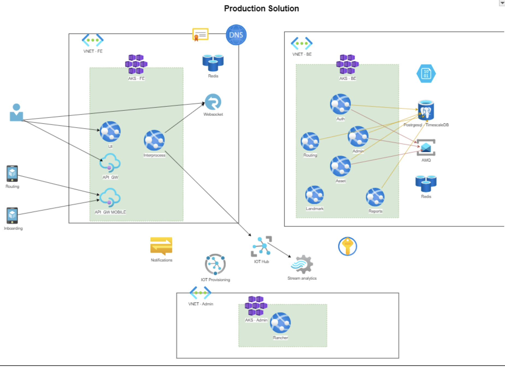

# IoT Smart Waste Management Solution

## Overview
This document outlines the high-level architecture, production setup, development process, and cost estimation for a smart waste management system leveraging IoT and a hybrid cloud design on Microsoft Azure.

## Solution Architecture
### High-Level Design
The system is based on a **Microservices Architecture** for ease of design, scalability, configurability, and management. The solution consists of the following components:

#### **Microservices (Back Office):**
1. **User Management Service (UMS):**
   - Azure MSSQL
   - Kubernetes Node
   - Azure Functions, Azure Service Bus, SMS Twilio, Azure Key Vault
2. **Customer Management Service (CMS):**
   - Azure MSSQL
   - Kubernetes Node
   - Azure Functions, Azure Service Bus, Mobile Notification
3. **Device Management Service (DMS)**
4. **Asset-Fleet Management Service (AFMS):**
   - Azure PostgreSQL Cluster, Azure Cosmos DB (Cassandra API)
   - Redis Cache, Azure Functions, Azure Time Series Insights
   - Supports GIS for GeoJSON
5. **Telemetry-Alarm-Rules Management Service (TARMS)**
6. **Azure IoT Hub Management Service (AIoTMS)**
7. **API Gateway for Service Registration (APIG)**

- **IoT Waste Devices :**

- **IoT Waste Devices - Prototype :**

#### **Microservices (Clients):**
1. **User Interface Service (UIS)**
2. **Customer Interface Service (CIS)**
3. **Remote Monitoring Service (RMS)**
4. **Power BI and Analytics (PBI)**

These microservices operate in a **stateless** configuration, orchestrated centrally for load balancing and scaling as necessary.

### Data Storage and Processing
The system manages telemetry data through a combination of hot and cold paths:

1. **Telemetry Management System:**
   - **Cold Path:** Azure Blob Storage
   - **Hot Path:** Azure Cosmos DB (Cassandra API)
   - **Stream Processing:** Azure IoT Hub, Azure Stream Analytics

### Development Processing
Continuous Integration and Continuous Deployment (CI/CD) pipelines are configured with:
- **Environments:** Staging and Testing
- **Hosts:** Virtual Machines (VMs)
- **Tools:** Azure Container Service, Jenkins in VMs

## Cost Planning
Below is the estimated monthly cost for the system based on its architecture:

| **Service**               | **Database**                     | **Host**           | **Managed Services**                                    | **Cost/Month**  | **Comments**                     |
|---------------------------|----------------------------------|--------------------|-------------------------------------------------------|-----------------|----------------------------------|
| User Management Service   | Azure MSSQL                     | Kubernetes Node    | Azure Functions, Service Bus, SMS Twilio, Key Vault   | ~$620           | Shared MSSQL with CMS            |
| Customer Management Service| Azure MSSQL                    | Kubernetes Node    | Azure Functions, Service Bus, Mobile Notifications    | ~$620           |                                  |
| Asset-Fleet Management Service| Azure PostgreSQL Cluster, Cosmos DB | Kubernetes Node    | Redis Cache, Azure Time Series Insights              | ~$520          | Includes GIS for GeoJSON         |
| Telemetry Management Service| Azure Blob (Cold), Cosmos DB (Hot) | Kubernetes Node    | Azure IoT Hub, Stream Analytics                      | ~$1200          | 400,000 messages/day IoT Hub ($25)|
| Other Services (TS, APIG) | Azure MSSQL                     | Kubernetes Nodes   | Power BI, Azure Databricks                           | ~$800           |                                  |

## Production Architecture
The production environment leverages:
- **Azure Kubernetes Service (AKS):** For container orchestration.
- **Azure IoT Hub:** Manages device connectivity and telemetry ingestion.
- **Azure Stream Analytics:** Processes real-time telemetry data.
- **Power BI and Azure Databricks:** For advanced analytics and reporting.

## Development Architecture
- **Staging and Testing Environments:** Hosted on VMs with Jenkins managing the CI/CD pipeline.
- **Azure Container Service:** Deploys containerized microservices efficiently.

- **Solution Architection :**

## Implementation Steps
1. **Setup Azure IoT Hub** for device communication.
2. **Develop Microservices** using scalable architectures with Kubernetes.
3. **Implement CI/CD Pipelines** for rapid deployment and testing.
4. **Configure Data Storage** for telemetry (hot and cold paths).
5. **Deploy Production Environment** with Kubernetes orchestration.

- **Storage Architection :**

## Conclusion
This IoT Smart Waste Management Solution leverages Azure’s cloud infrastructure to deliver a scalable, cost-efficient, and effective system for managing solid waste. For further details, refer to the respective microservices documentation or the cost planning sheet.

